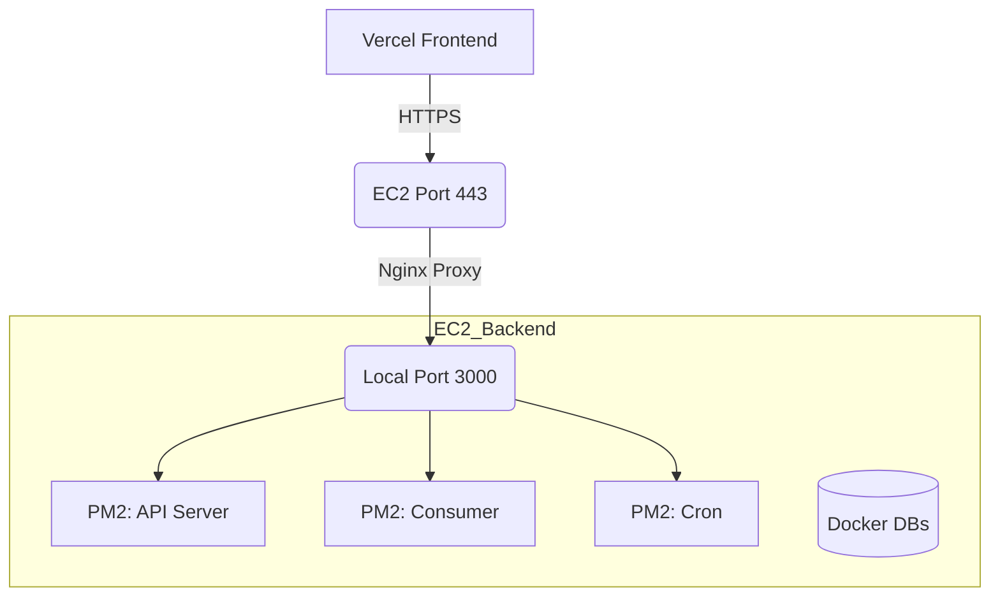

# Xness: Production Deployment Flow (PM2 + Vercel + Nginx)

This guide provides a professional, production-grade workflow using Nginx as a reverse proxy with SSL.

## 🟢 Production Architecture



---

## �️ Step 1: Install Nginx & Certbot on EC2

```bash
sudo apt update
sudo apt install -y nginx certbot python3-certbot-nginx
```

---

## ⚙️ Step 2: Configure Nginx

1.  **Create the config file**:
    ```bash
    sudo nano /etc/nginx/sites-available/xness
    ```
2.  **Paste the following** (Replace `yourdomain.com` with your actual domain):
    ```nginx
    server {
        listen 80;
        server_name yourdomain.com;

        location / {
            proxy_pass http://localhost:3000;
            proxy_http_version 1.1;
            proxy_set_header Upgrade $http_upgrade;
            proxy_set_header Connection 'upgrade';
            proxy_set_header Host $host;
            proxy_cache_bypass $http_upgrade;
            proxy_set_header X-Real-IP $remote_addr;
            proxy_set_header X-Forwarded-For $proxy_add_x_forwarded_for;
        }
    }
    ```
3.  **Enable the config**:
    ```bash
    sudo ln -s /etc/nginx/sites-available/xness /etc/nginx/sites-enabled/
    sudo rm /etc/nginx/sites-enabled/default
    sudo nginx -t
    sudo systemctl restart nginx
    ```

---

## � Step 3: Setup SSL (HTTPS)

Run Certbot to automatically fetch and install an SSL certificate:

```bash
sudo certbot --nginx -d yourdomain.com
```

> [!TIP]
> Choose the option to **Redirect all HTTP traffic to HTTPS**.

---

## 🚀 Step 4: Backend & Infrastructure (PM2)

Follow the same steps as before to start your backend:

1.  **Infrastructure**: `docker compose -f docker-compose.infra.yml up -d`
2.  **Backend Dependencies**: `cd server && npm install`
3.  **Prisma**: `npx prisma db push`
4.  **Start PM2**: `pm2 start ecosystem.config.cjs`

---

## 🌐 Step 5: Vercel Frontend Configuration

In your Vercel Dashboard, update your environment variables to use your **Domain Name** instead of the IP:

*   `VITE_BASE_API_URL`: `https://yourdomain.com/api`
*   `VITE_SOCKET_URL`: `https://yourdomain.com`

> [!IMPORTANT]
> Since Nginx is now handling the traffic, you **MUST** use `https://` in Vercel.

---

## 🛡️ Step 6: Security Group

1.  **Open**: Port `80` (HTTP) and `443` (HTTPS).
2.  **Close**: Port `3000` (it is now protected behind Nginx).

---

---

## 🏗️ Step 7: Multiple Apps on One Domain

If you have multiple apps (e.g., Xness and a Blog) and only one domain, you should use **Subdomains**.

### 1. DNS Configuration
Add the following records to your Domain Provider (GoDaddy, Namecheap, etc.):

| Type | Name | Value | Purpose |
| :--- | :--- | :--- | :--- |
| **CNAME** | `xness` | `cname.vercel-dns.com` | Xness Frontend |
| **A** | `api-xness`| `<EC2_IP>` | Xness Backend |
| **CNAME** | `other` | `cname.vercel-dns.com` | Other App Frontend |
| **A** | `api-other`| `<EC2_IP>` | Other App Backend |

### 2. Multi-App Nginx Config (EC2)
Update your `/etc/nginx/sites-available/xness` to handle both APIs:

```nginx
# Xness API
server {
    listen 80;
    server_name api-xness.yourdomain.com;
    location / {
        proxy_pass http://localhost:3000;
        ...
    }
}

# Other App API
server {
    listen 80;
    server_name api-other.yourdomain.com;
    location / {
        proxy_pass http://localhost:4000; # Run other app on different port
        ...
    }
}
```

### 3. Vercel Configuration
In Vercel:
*   **App 1**: Add domain `xness.yourdomain.com`
*   **App 2**: Add domain `other.yourdomain.com`

---

## 🔍 Monitoring

| Task | Command |
| :--- | :--- |
| **View App Logs** | `pm2 logs` |
| **View Nginx Error Logs** | `sudo tail -f /var/log/nginx/error.log` |
| **Test Nginx Config** | `sudo nginx -t` |
| **Check Cert Renewal** | `sudo certbot renew --dry-run` |
| **Restart Nginx** | `sudo systemctl restart nginx` |
| **Restart PM2** | `pm2 restart all` |
